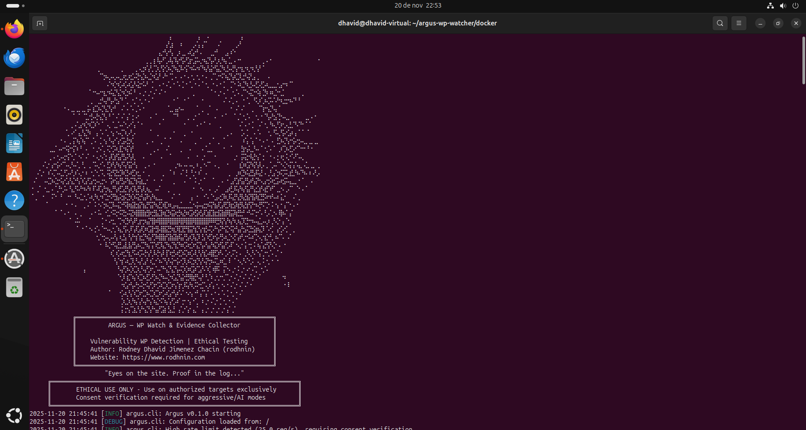
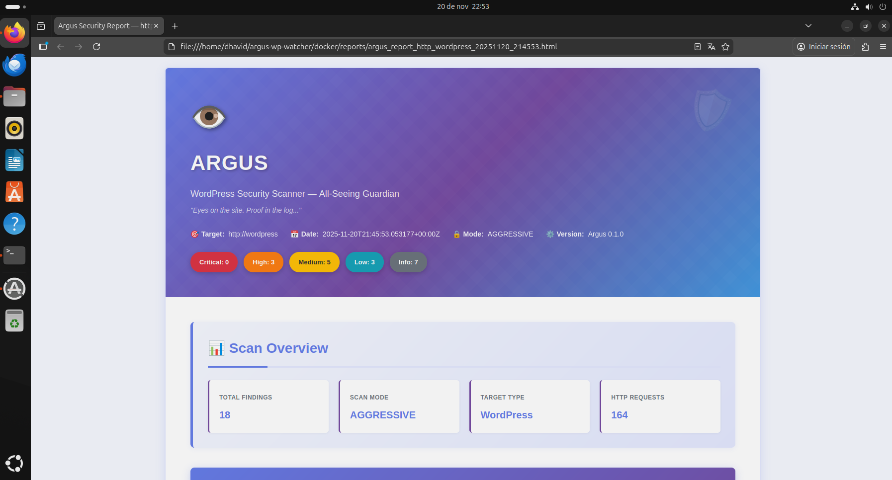
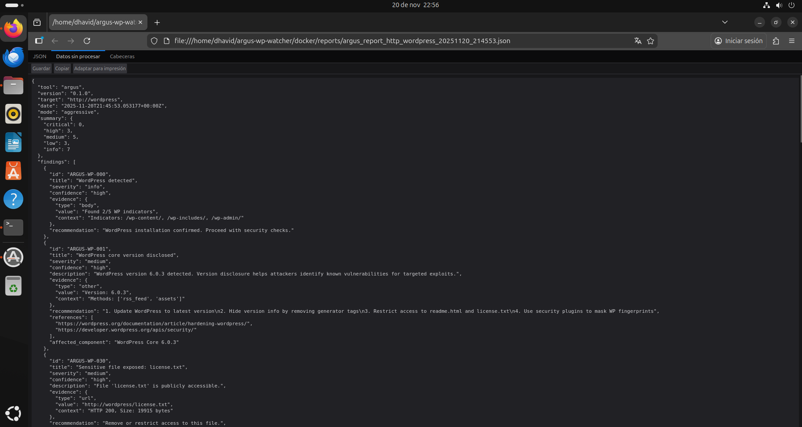

# Argus — WordPress Security Scanner with AI-Powered Analysis

```
⠀⠀⠀⠀⠀⠀⠀⠀⠀⠀⠀⠁⠀⠀⠀⠀⠀⠀⠀⠀⠀⠀⠀⠀⠀⠀⠀⠀⠀⠀⠀⠀⠀⠀⠀⠀⠀⠀⠀⡅⠀⠀⠀⠀⠀⠀⠀⡄⠀⠠⠀⠀⠀⠀⠀⠀⠀⠀⠀⡌⠀⠀⠀⠀⠀⠀⠀⠀⠀⠀⠀⠀⠀⠀⠀⠀⠀⠀⠀⠀⠀
⠀⠀⠀⠀⠀⠀⠀⠀⠀⠀⠀⠀⠀⠀⠀⠀⠀⠀⠀⠀⠀⠀⠀⠀⠀⠀⠀⠀⠀⠀⠀⠀⠀⠀⠀⠀⠀⠀⡜⣰⠀⠀⠆⠀⠀⢀⠌⡄⡌⠁⠀⠀⠠⠁⠀⠀⠀⢀⠜⠀⠀⠀⠀⠀⠀⠀⠀⠀⠀⠀⠀⠀⠀⠀⠀⠀⠀⠀⠀⠀⠀
⠀⠀⠀⠀⠀⠀⠀⠀⠀⠀⠀⠀⠀⠀⠀⠀⠀⠀⠀⠀⠀⠀⠀⠀⠀⠀⠀⠀⠀⠀⠀⠀⠀⠀⠀⠀⣄⠚⡔⢣⠀⡰⢀⡀⠴⣡⠚⠠⠀⠀⢀⡐⠃⠀⢀⡄⠎⠂⠀⠀⠀⠀⠀⠀⠀⠀⠀⠀⠀⠀⠀⠀⠀⠀⠀⠀⠀⠀⠀⠀⠀
⠀⠀⠀⠀⠀⠀⠀⠀⠀⠀⠀⠀⠀⠀⠀⠀⠀⠀⠀⠀⠀⠀⠀⠀⠀⠀⠀⠀⠀⠀⠀⠀⢀⢀⢰⠸⡤⠋⡠⢧⠹⡔⢫⠜⣱⢂⡭⢄⠲⣌⢣⠜⡰⡘⢦⢈⡀⠄⠒⠀⠀⠀⠀⠀⠀⡀⠄⠂⠀⠀⠀⠀⠀⠀⠀⠀⠀⠀⠀⠀⠐
⠀⠀⠀⠀⠀⠀⠀⠀⠀⠀⠀⠀⠀⠀⠀⠀⠀⠀⠀⡀⠀⠀⠀⠀⠀⢀⠀⠀⠀⢀⠠⣐⠎⡜⡈⡱⡘⡕⡱⢌⠳⣌⠧⢪⠑⠮⠔⠎⠳⡜⣬⠚⣥⡙⢆⡣⢜⢣⠒⣆⠲⡐⢆⢣⠃⠁⠀⠀⠀⠀⠀⠀⠀⠀⠀⠀⠀⠀⠀⠀⠀
⠀⠀⠀⠀⠀⠀⠀⠀⠀⠀⠀⠀⠀⠀⠀⠀⠀⠀⠀⠈⢑⠦⡠⢄⠤⣀⢖⡰⣊⠬⡓⣌⠦⣈⠲⣡⠃⠜⠂⢉⠠⠀⠄⠂⠄⢂⠐⡀⠂⠄⢀⠉⡐⠪⠱⣌⢣⢎⡹⣐⠣⡝⣠⢀⠀⠀⠠⠀⠀⠀⠀⠀⠀⠀⠀⠀⠀⠀⠀⠀⠀
⠀⠀⠀⠀⠀⠀⠀⠀⠀⠀⠀⠀⠀⠀⠀⠀⠀⠀⠀⠀⠀⠠⠑⢎⠲⡡⢎⠴⣡⠣⣕⠪⠜⠀⡁⠀⠄⠂⠌⡀⠂⠡⢈⠐⠈⡀⠂⠄⠁⢂⠀⠂⠄⠂⡁⠀⡉⠂⠵⣈⠳⣘⠤⣋⢜⡡⢆⣀⣀⢂⡔⠲⠈⠁⠀⠀⠀⠀⠀⠀⠀
⠀⠀⠀⠀⠀⠀⠀⠀⠀⠀⠀⠀⠀⠀⠀⠀⠈⠐⠢⠔⢲⡐⠮⣌⢣⡑⢎⡲⠅⠃⠠⢀⠂⡐⠠⠁⠌⠐⠀⠀⠀⠀⠀⠀⠀⢀⠀⠀⠀⠀⠈⠐⢀⠂⠄⠁⠐⡈⠄⡈⠑⢬⡑⠪⡆⣙⠆⠶⣈⠒⣈⠀⠀⠀⠀⠀⡀⠀⠀⠀⠀
⠀⠀⠀⠀⠀⠀⠀⠀⠀⠀⠀⠀⠀⠀⠀⠀⠀⡀⠀⣐⠣⡜⢣⠜⣢⠙⠈⡀⠐⡈⠐⡀⠂⠄⠁⠀⠀⠀⠀⠀⠂⠁⠀⠂⠁⠀⠀⠀⠂⠀⠀⠀⠀⠀⠌⠠⢁⠠⠀⠐⠈⡀⠘⢅⠎⡰⢌⠥⠡⠓⢆⣒⠲⠌⠃⠃⠀⠀⠀⠀⠀
⠀⠀⠀⠀⠀⠀⠀⠀⠀⠐⠠⢀⡀⣀⢀⡀⡥⢰⣉⠦⡙⣌⢣⠚⠀⠠⠁⠄⠡⢀⠡⠐⠀⠀⠀⠀⠀⠀⠈⣀⢠⡔⠤⠀⠀⠀⠈⠀⡀⠀⠁⠀⠄⠀⠀⠀⠂⠠⠁⠌⠀⠀⡀⠀⠉⡖⢢⡙⢤⠈⠀⠀⠀⠀⠀⠀⠀⠀⠀⠀⠀
⠀⠀⠀⠀⠀⠀⠀⠀⠀⠀⠀⠀⠁⠈⠀⢉⡐⡣⢜⢢⡙⡄⠃⠁⠌⠠⠁⡌⢐⠠⠂⠀⠀⠠⠀⠁⠀⡀⠀⠀⠉⠃⠀⠀⡀⢀⠂⠁⠀⠈⠀⠠⠀⠐⠈⠀⠀⠁⡈⠐⡈⠄⠀⢂⠐⠈⢣⠜⣢⢙⠢⢄⡀⠄⠀⠀⠀⣀⠠⠐⠀
⠀⠀⠀⠀⠀⠀⠀⠀⠀⠀⠀⢀⠠⢁⡔⢎⠲⣉⠎⠂⠁⠠⡀⢁⡈⠤⠑⡠⠊⡄⠁⠂⠀⠀⠀⠀⠂⠀⠀⠀⠀⠀⠀⠂⠀⠀⠠⠐⠈⠀⠂⠀⠀⡀⠀⠀⠀⠀⠠⠁⠄⠂⡁⠀⠌⠐⡀⠳⢄⢋⠖⡠⣘⡈⠣⠙⠂⠁⠁⠀⠀
⠀⠀⠀⠀⠀⠀⠀⠀⠀⠀⢁⠠⠊⢠⡘⣌⠳⠀⢠⠈⠄⢁⠐⡄⠢⢌⠱⡠⢃⠄⠀⠀⠀⠈⠀⢀⠀⠀⠀⠀⠂⠀⠀⡀⠀⠂⠀⠀⠀⠀⠀⠀⠀⠀⠀⡀⠄⠀⠀⡡⢈⠀⠠⠈⠄⠀⠐⡀⠫⢄⢫⠔⣡⠆⡄⠁⠁⠈⠀⠀⠀
⠀⠀⠀⠀⠀⠀⠀⠀⠐⠠⠀⡀⡍⢦⠱⡌⠁⡈⠄⢈⠐⡄⠣⡔⢡⢊⡥⣓⢎⠀⠀⠀⢀⠀⠄⠀⢀⠈⠀⠁⠀⠀⠄⠀⠀⠀⡀⠈⠀⠀⡀⠁⢀⠀⠁⠀⠀⠀⠀⠰⢡⠈⡄⠁⠂⠄⠂⠠⠀⣋⠦⡙⡔⢪⠔⡢⢄⡀⣀⢀⡀
⠀⠀⠀⠀⠀⢀⣀⠁⠤⠒⢭⠒⡍⠆⠃⠠⠀⠐⢀⠢⢁⠨⡑⡩⢆⣏⠲⡍⡞⠀⠀⠀⠀⠀⢀⠠⠀⠀⠌⠀⠀⠀⡀⠀⠠⠀⠀⠀⠄⢁⣀⠀⠀⠀⠂⠀⠁⠀⠀⣳⢢⢅⡘⠤⠈⠐⡈⠄⠁⢀⠎⡱⢜⡡⠊⠑⠒⠘⠐⠀⠀
⠀⠀⠀⠀⠀⢀⠠⠐⡠⢔⢪⠑⡈⠐⠌⠠⠁⠐⠠⡐⠌⡂⡼⣱⢫⡜⣣⠝⡼⡀⠀⠠⠀⠈⠀⠀⠠⠀⠀⠁⠀⠀⠀⠀⠄⠀⠐⠀⡐⠀⠀⠐⠀⠀⠀⠀⠀⡐⠀⡭⣕⠺⣜⢢⠁⡂⠀⠂⠄⡂⢖⠨⡐⠡⠋⠤⡀⠀⠀⠀⠀
⠀⠀⠀⠠⢁⠂⡔⢪⠔⠉⠤⡘⠤⢁⠘⡀⢀⠈⠥⡐⠡⢘⡱⢣⠳⡜⢥⢫⡕⢣⠀⠀⡀⠄⠐⠀⠀⠀⠀⠀⢀⠲⠄⠤⠠⢄⠰⢀⠐⠌⠁⠠⢀⠀⠀⠂⠀⠀⢰⡱⢎⡝⢮⢣⢇⠄⡀⢁⠤⠉⠢⡑⢬⢡⠡⣄⠠⣁⢀⡀⢀
⠀⠀⠌⡐⠀⠎⢌⠡⢌⡘⡡⠜⡰⠡⡐⠰⠀⢂⠑⡈⢅⠨⣕⢫⣓⡹⢎⡣⢞⡱⣂⠐⠀⡀⠀⠀⠀⡀⠀⠁⠆⠀⠌⢘⠀⢃⠂⠎⠀⠄⠀⠀⠀⠀⠀⢀⠀⢀⠶⣙⠮⣜⣣⠯⣜⠠⢀⢃⡌⡲⢍⠭⣰⣃⠳⠌⠳⠄⠆⠜⡠
⠀⠌⠀⠀⠤⣉⠦⣑⠪⡔⣡⢣⡑⢣⠱⣡⢋⡔⡢⢄⡒⠄⢩⠖⣥⢛⡬⢳⣍⢳⢭⣆⡐⠀⠐⠀⠐⠀⠀⠀⡀⠀⠀⠄⠈⠀⠅⡐⠈⠀⠀⠁⠀⠠⠀⠂⣠⢋⡞⣥⢛⡴⢣⡝⠢⣠⢒⠵⣊⡥⢖⡭⢤⣀⡀⠂⠁⠀⠠⠀⠀
⠐⠀⡈⠀⢂⡀⠄⢁⠓⡨⠄⢣⡘⠥⠓⠦⠳⠸⠡⢏⡜⡲⣄⠛⡴⣋⣜⢣⢎⢧⡛⡼⡰⣄⠀⠤⠁⠀⢀⠀⠀⠀⠀⠀⠀⠐⠀⠐⠄⠀⠄⢀⠌⠀⢀⡴⣃⠯⡜⢦⢫⡜⢣⣊⡞⢴⡋⠞⠁⣀⠢⢀⠌⠁⠈⠂⠄⠁⠀⠀⠀
⠈⢀⠀⠐⠀⠀⠍⠂⠘⠀⠐⠂⠘⠤⣁⢂⠡⢆⠳⡐⠎⣑⠪⢛⣦⢕⡮⣙⢎⠮⣕⢣⡽⢢⠳⣄⣀⠀⠀⠠⠁⠈⠀⠀⠀⡄⠐⠀⠐⠡⠈⢂⡤⣊⠷⡸⢥⡛⣜⢧⣳⡝⣯⢷⣙⡫⠖⠞⠤⠆⣅⠂⠀⠠⠁⡀⠀⠀⠀⠀⠀
⠀⠀⠀⠀⠈⠀⠀⠀⠀⠀⠂⠐⠠⠀⠀⡀⠌⠀⠅⠢⢑⠦⣉⠧⢬⡑⠫⡷⣮⣗⣮⢳⣜⢫⡝⢦⣋⢾⡱⢆⡤⣄⣁⣀⣈⡐⢬⠤⣔⡲⢭⢳⡼⣡⢟⡹⣖⡽⣞⢧⣳⢫⠓⠦⡛⠍⡑⠨⠐⡄⠂⡌⠑⠠⠐⠀⠀⠀⠀⠀⠀
⠀⠀⠀⠀⠀⠀⠀⠁⠈⠠⠐⠀⠠⠀⡀⠀⠀⠄⠂⠥⠀⢊⡐⠭⡒⠭⣓⠬⣝⢾⣿⣿⣞⡷⣚⣧⣹⢶⣙⢮⡵⣚⢦⡳⢎⡵⣫⢞⡼⣱⣏⣷⣺⣽⣾⢿⣭⢷⣛⡚⠐⠣⠍⡒⠡⠘⡠⢁⠢⠸⡷⠌⢠⠁⠀⠀⠀⠀⠀⠀⠀
⠀⠀⠀⠀⠀⠀⠀⠀⠀⠀⠀⠁⠠⠥⠀⠀⠈⠀⠀⠀⡁⠂⠔⣂⠈⡑⢎⡳⢣⠟⣰⢒⢦⡝⣿⠾⣿⣿⡿⣿⣿⡿⣿⢿⣿⡿⣿⣿⣿⣿⠿⠿⣛⢯⢣⠳⡜⢆⢦⡹⣙⠒⠦⢤⣁⠤⡰⢀⠣⡑⢠⠈⢂⠀⠀⠀⠀⠀⠀⠀⠀
⠀⠀⠀⠀⠀⠀⠀⠀⠀⠀⠀⠀⠀⠁⠐⠈⠐⠄⡊⠄⠑⠢⢄⢂⠱⣄⢫⢄⠏⡼⣡⢏⠶⣩⡗⣻⢼⣿⣝⡳⣎⢿⣹⡛⣯⡝⣎⢣⢲⡣⢍⠜⢢⠝⢪⡑⢭⠚⣤⢓⡬⣙⣪⡶⣌⠇⠡⢊⠀⡔⡡⢊⠀⢀⠀⠀⠀⠀⠀⠀⠀
⠀⠀⠀⠀⠀⠀⠀⠀⠀⠀⠀⠀⠀⠀⠀⠀⠀⠀⠐⡈⢒⠤⡠⠜⡄⢆⣣⠘⡜⢲⢱⣊⠳⣥⢋⠷⣿⣷⢫⣷⣽⡾⣥⢛⡴⡹⣌⠇⣣⠱⣋⠖⡥⢛⠴⣈⠢⡋⡴⢃⠒⠥⠎⡑⢄⢲⡑⢃⠰⠌⠡⠀⠌⠀⠀⠀⠀⠀⠀⠀⠀
⠀⠀⠀⠀⠀⠀⠀⠀⠀⠀⠀⠀⠀⠀⠀⠀⠀⠀⠀⠐⠀⠧⡑⠫⣜⣃⣼⣸⡜⣣⠦⣉⠳⡌⡍⢞⡹⣌⠳⣌⢳⡙⠶⡩⢖⡱⢪⡙⡤⢣⡜⢮⡱⢫⡜⡡⠏⠐⢄⠂⡅⢒⠨⠰⡌⣔⢫⠣⡑⠠⠀⠂⠀⠀⠀⠀⠀⠀⠀⠀⠀
⠀⠀⠀⠀⠀⠀⠀⠀⠀⠀⠀⠀⠀⠀⠀⠀⠀⠀⠀⠀⠀⠀⠰⡁⢎⠴⣊⢳⡘⠥⢎⠥⡓⡜⡸⢜⢢⠇⡏⢖⡣⢞⡱⢍⠶⡡⢇⢣⢳⡡⢾⣟⡱⠣⢈⠔⡨⢑⠠⠀⡘⢄⠣⠑⡌⡐⢂⠡⢀⠁⠂⠀⠀⠀⠀⠀⠀⠀⠀⠀⠀
⠀⠀⠀⠀⠀⠀⠀⠀⠀⠀⠀⠀⠀⠀⠀⠀⠀⠀⠀⠀⠀⠀⠀⠘⡌⢲⠡⢆⡹⡘⢤⢃⡜⠰⣁⠊⠦⠙⡜⢬⠒⡥⢊⢇⠮⣑⢎⢣⠣⡝⡲⠬⣁⠶⣁⠸⠀⠁⠢⡘⠌⢂⠅⠠⡀⠅⢂⠐⠀⠂⠀⠀⠀⠀⠀⠀⠀⠀⠀⠀⠀
⠀⠀⠀⠀⠀⠀⠀⠀⠀⠀⠀⠀⠀⠀⠀⡄⠀⠀⠀⠀⠀⠀⠀⠀⠘⢤⢋⠦⡱⣉⢆⠣⡜⡱⢂⠡⠌⠓⣌⢣⡙⡤⢍⢎⠶⣩⠎⣡⠣⠱⡁⢾⠯⠀⡍⠢⢀⠂⠅⡐⠠⠂⠌⡁⠐⡈⠄⠀⠀⠀⠀⠀⠀⠀⠀⠀⠀⠀⠀⠀⠀
⠀⠀⠀⠀⠀⠀⠀⠀⠀⠀⠀⠀⠀⠀⠀⠀⠀⠀⠀⠀⠀⠀⠀⠀⠈⢂⠇⣎⠱⡌⢎⡱⢜⡡⢋⠦⡙⠦⢌⠲⣡⡙⣬⢚⡻⣷⡛⢤⠃⢃⠱⢀⢂⠒⡈⢁⠂⠌⡐⠠⠁⠌⡐⠠⠁⠀⠀⠀⠀⠀⠐⠆⠀⠀⠀⠀⠀⠀⠀⠀⠀
⠀⠀⠀⠀⠀⠀⠀⠀⠀⠀⠀⠀⠀⠀⠀⠀⠀⠀⠀⠀⠀⠀⠀⠀⠀⠐⢎⡔⢣⠜⡢⢕⠪⡜⡱⢊⠵⣉⢎⡱⢢⢱⢂⠯⡜⢆⠭⢒⡉⢄⠎⡄⢂⠐⠄⠂⠌⡐⠠⠁⠌⠐⠀⠀⠀⠀⠀⠀⠀⠀⠀⠂⠇⠀⠀⠀⠀⠀⠀⠀⠀
⠀⠀⠀⠀⠀⠀⠀⠀⠀⠀⠀⠀⠀⠀⠀⠀⠀⠀⠀⠀⠀⠀⠁⠀⠀⢊⠴⡘⡌⢎⡱⢊⡱⢌⡱⣉⠖⡡⢎⡔⢣⠎⠌⠐⠔⡄⠚⢠⠉⡌⠠⠐⠠⠈⠄⡁⢂⠐⠠⠁⠀⠀⠀⠀⠀⠀⠀⠀⠀⠀⠀⠀⠀⠀⠀⠀⠀⠀⠀⠀⠀
⠀⠀⠀⠀⠀⠀⠀⠀⠀⠀⠀⠀⠀⠀⠀⠀⠀⠀⠀⠀⠀⠀⠀⠀⠀⢈⢆⡱⡘⢦⢡⠣⡜⢢⠱⣌⠪⠱⡌⡜⡡⠎⢐⠂⢢⠐⢁⠀⠆⡐⠠⢁⠂⡁⢂⠐⠠⠈⠀⠀⠀⠀⠀⠀⠀⠀⠀⠀⠀⠀⠀⠀⠀⠀⠀⠀⠀⠀⠀⠀⠀
⠀⠀⠀⠀⠀⠀⠀⠀⠀⠀⠀⠀⠀⠀⠀⠀⠀⠀⠀⠀⠀⠀⠀⠀⠀⢨⢐⢢⢉⣆⢣⠓⣌⢣⠓⣤⢋⣵⢘⣄⡃⢠⢁⠊⡔⢠⡈⠀⡄⡐⢀⠂⡐⢀⠂⡌⢀⠁⠀⠀⠀⠀⠀⠀⠀⠀⠀⠀⠀⠀⠀⠀⠀⠀⠀⠀⠀⠀⠀⠀⠀
            ╔═══════════════════════════════════════════════════════╗
            ║         ARGUS — WP Watch & Evidence Collector         ║
            ║                                                       ║
            ║    Vulnerability WP Detection | Ethical Testing       ║
            ║    Author: Rodney Dhavid Jimenez Chacin (rodhnin)     ║
            ║    Website: https://www.rodhnin.com                   ║
            ╚═══════════════════════════════════════════════════════╝
                     "Eyes on the site. Proof in the log..."
     ╔═════════════════════════════════════════════════════════════════════╗
     ║       ETHICAL USE ONLY - Use on authorized targets exclusively      ║
     ║       Consent verification required for aggressive/AI modes         ║
     ╚═════════════════════════════════════════════════════════════════════╝
```

<div align="center">


**Ethical WordPress vulnerability scanner with AI-powered analysis and consent-based testing**

[🚀 Quick Start](#-quick-start) •
[📖 Documentation](docs/) •
[🐳 Docker](#-docker-deployment) •
[🤖 AI Features](#-ai-powered-analysis) •
[⭐ Star Us](https://github.com/rodhnin/argus-wp-watcher)

</div>

---

## 🎬 Demo

### Scanner in Action

<div align="center">
  

_Demo showing:_

-   CLI execution with real-time progress indicators
-   Vulnerability detection and evidence collection
-   HTML report generation
</div>

---

## 📸 Screenshots

### Console Execution

<div align="center">
  

_Real-time scan execution_

</div>

### HTML Report

<div align="center">
  

_Beautiful HTML report with:_

-   🎨 Mystical theme with deep purple/dark tones
-   🏷️ Color-coded severity badges (Critical, High, Medium, Low, Info)
-   📝 Expandable evidence sections showing HTTP responses
-   🤖 AI-generated hardening guides (technical + executive modes)
-   📊 WordPress information and vulnerability details
</div>

### JSON Report

<div align="center">
  

_Machine-readable JSON report for:_

-   🤖 Programmatic processing and automation
-   📈 Historical analysis and reporting
-   🔍 Detailed findings with evidence and severity classification
</div>

---

## 🎯 What is Argus?

Argus is a production-ready WordPress security scanner that puts **ethics first**. Built for penetration testers, security researchers, and WordPress administrators, it combines traditional vulnerability scanning with cutting-edge AI analysis to deliver actionable insights.

### Why Argus?

-   **🔒 Ethical by Design**: Consent token system prevents unauthorized scanning
-   **🤖 AI-Powered**: GPT-4, Claude, or local Ollama for intelligent remediation guides
-   **📊 Professional Reports**: Beautiful HTML + machine-readable JSON
-   **🚀 Fast & Efficient**: Concurrent scanning with intelligent rate limiting
-   **💾 Persistent Tracking**: SQLite database for scan history and trend analysis
-   **🐳 Docker Ready**: Containerized scanning + vulnerable test lab included

### What It Scans

| Check Category          | Details                                                       |
| ----------------------- | ------------------------------------------------------------- |
| **WordPress Detection** | Version fingerprinting via meta tags, readme, RSS, assets     |
| **Plugins & Themes**    | Enumeration of 100+ popular plugins/themes with version hints |
| **Sensitive Files**     | 70+ paths including wp-config backups, .env, SQL dumps, .git  |
| **User Enumeration**    | Safe techniques: Author IDOR, REST API, HTML parsing          |
| **Security Headers**    | HSTS, CSP, X-Frame-Options, cookie security                   |
| **Misconfigurations**   | XML-RPC, debug mode, directory listing, file editor           |

---

## ✨ Features

### 🛡️ Core Security Scanning

```bash
# One command, comprehensive analysis
python -m argus --target https://example.com --html
```

-   **Multi-Method Fingerprinting**: Detects WordPress 4.x-6.x with zero false positives
-   **Concurrent Scanning**: Thread pool + rate limiting for fast, respectful scans
-   **Smart Detection**: Early abort for non-WordPress sites (99% faster rejection)
-   **Evidence Collection**: HTTP responses, headers, and file contents preserved

### 🤖 AI-Powered Analysis

Choose your AI provider based on your needs:

| Provider             | Best For           | Speed           | Cost          | Privacy         |
| -------------------- | ------------------ | --------------- | ------------- | --------------- |
| **OpenAI GPT-4**     | Production quality | ⚡ Fast (35s)   | 💰 $0.25/scan | 🔒 Standard     |
| **Anthropic Claude** | Privacy-focused    | ⚡ Fast (45s)   | 💰 $0.30/scan | 🔒 Enhanced     |
| **Ollama (Local)**   | Complete privacy   | 🐢 Slow (28min) | 💰 Free       | 🔐 100% Offline |

**Two Analysis Modes:**

-   **Technical**: Step-by-step remediation with commands and configuration snippets
-   **Executive**: Plain-language summaries for stakeholders and management

### 📊 Professional Reporting

**JSON Reports** (Machine-Readable)

```json
{
  "tool": "argus",
  "version": "0.1.0",
  "target": "https://example.com",
  "summary": {
    "critical": 9,
    "high": 6,
    "medium": 14,
    "low": 4,
    "info": 66
  },
  "findings": [...]
}
```

**HTML Reports** (Human-Friendly)

-   🎨 Responsive design with inline CSS
-   🏷️ Color-coded severity badges
-   📝 Expandable evidence sections
-   🤖 AI analysis beautifully formatted
-   📱 Mobile-friendly

### 🔐 Consent Token System

Argus enforces ethical hacking through technology. Aggressive scanning and AI analysis require **proof of ownership**:

```bash
# 1. Generate token
python -m argus --gen-consent example.com

# 2. Place token on your server
echo "verify-abc123..." > .well-known/verify-abc123.txt

# 3. Verify ownership
python -m argus --verify-consent http --domain example.com --token verify-abc123

# 4. Now you can use aggressive mode
python -m argus --target https://example.com --aggressive --use-ai
```

### 💾 Database Persistence

SQLite database tracks everything:

-   **Scan History**: Date, duration, findings count, severity breakdown
-   **Finding Repository**: Searchable vulnerability database
-   **Verified Domains**: Consent token tracking with expiration
-   **Trend Analysis**: Compare scans over time

```bash
# Query recent scans
sqlite3 ~/.argos/argos.db "SELECT * FROM v_recent_scans LIMIT 10"

# Find critical issues
sqlite3 ~/.argos/argos.db "SELECT * FROM v_critical_findings"
```

---

## 🚀 Quick Start

### Prerequisites

-   **Python 3.11+** (3.12 recommended)
-   **pip** (Python package manager)
-   **Docker** (optional, for containerized scanning)

### Installation

**1. Clone the repository**

```bash
git clone https://github.com/rodhnin/argus-wp-watcher.git
cd argus-wp-watcher
```

**2. (Optional) Install `venv` if not already available**

```bash
# Debian/Ubuntu
sudo apt update && sudo apt install -y python3-venv

# Fedora/RHEL
sudo dnf install python3-virtualenv

# macOS (via Homebrew)
brew install python@3.11
```

**3. Create and activate virtual environment**

```bash
python3 -m venv .venv
source .venv/bin/activate
# You should see (.venv) in your terminal prompt
```

**4. Upgrade pip**

```bash
python -m pip install --upgrade pip
```

**5. Install dependencies**

```bash
python -m pip install -r requirements.txt
```

**6. Configure API keys (if using cloud AI)**

```bash
# OpenAI
export OPENAI_API_KEY="sk-..."

# Anthropic
export ANTHROPIC_API_KEY="sk-ant-..."
```

**7. Verify installation**

```bash
python -m argus --version
# Output: Argus v0.1.0
```

### Your First Scan

```bash
# Basic scan (safe mode, no consent required)
python -m argus --target https://example.com

# With HTML report
python -m argus --target https://example.com --html

# With AI analysis (requires consent token)
python -m argus --target https://example.com --use-ai --html
```

**🎉 Success!** Check `~/.argos/reports/` for your reports.

---

## 📘 Usage Guide

### Basic Scanning

```bash
# Safe mode (default) - Non-intrusive checks
python -m argus --target https://example.com

# Generate HTML report
python -m argus --target https://example.com --html

# Increase verbosity for debugging
python -m argus --target https://example.com -vv
```

### Advanced Scanning

```bash
# Control scan speed (1-20 req/s)
python -m argus --target https://example.com --rate 10

# Control concurrency (1-20 threads)
python -m argus --target https://example.com --threads 8

# Custom timeout
python -m argus --target https://example.com --timeout 60

# Custom output directory
python -m argus --target https://example.com --report-dir ./my-reports
```

### AI-Powered Analysis

**Step 1: Configure your provider**

Edit `config/defaults.yaml`:

```yaml
ai:
    langchain:
        provider: "openai" # Options: openai, anthropic, ollama
        model: "gpt-4-turbo-preview"
        temperature: 0.3
```

**Step 2: Test your setup**

```bash
# Verify AI provider works
python -m argus.core.ai openai
```

**Step 3: Run AI-powered scan**

```bash
# Technical analysis (for security teams)
python -m argus --target https://example.com \
  --use-ai \
  --ai-tone technical \
  --html

# Executive summary (for management)
python -m argus --target https://example.com \
  --use-ai \
  --ai-tone non_technical \
  --html

# Both analyses in one report
python -m argus --target https://example.com \
  --use-ai \
  --ai-tone both \
  --html
```

### Aggressive Mode (Requires Consent)

```bash
# Step 1: Generate consent token
python -m argus --gen-consent example.com
# Output: Token: verify-a3f9b2c1d8e4...

# Step 2: Place token on your server
# Create: https://example.com/.well-known/verify-a3f9b2c1d8e4.txt
# Content: verify-a3f9b2c1d8e4

# Step 3: Verify consent
python -m argus --verify-consent http \
  --domain example.com \
  --token verify-a3f9b2c1d8e4

# Step 4: Run aggressive scan
python -m argus --target https://example.com --aggressive
```

---

## 🤖 AI-Powered Analysis

Argus uses **LangChain 1.0.0** with support for multiple AI providers, giving you flexibility based on your security, privacy, and budget requirements.

### Supported Providers

#### OpenAI GPT-4 Turbo

**Best for: Production use**

-   ⭐ Quality: Excellent (5/5)
-   ⚡ Speed: ~35 seconds
-   💰 Cost: ~$0.25 per scan
-   🔒 Privacy: Standard (data encrypted in transit)

```bash
export OPENAI_API_KEY="sk-..."
python -m pip install langchain-openai==1.0.0
```

#### Anthropic Claude

**Best for: Enhanced privacy**

-   ⭐ Quality: Excellent (5/5)
-   ⚡ Speed: ~45 seconds
-   💰 Cost: ~$0.30 per scan
-   🔒 Privacy: Enhanced (Anthropic's privacy-first approach)

```bash
export ANTHROPIC_API_KEY="sk-ant-..."
python -m pip install langchain-anthropic==1.0.0
```

#### Ollama (Local Models)

**Best for: Complete privacy**

-   ⭐ Quality: Good (3/5)
-   🐢 Speed: ~28 minutes (CPU) or ~75 seconds (GPU)
-   💰 Cost: Free
-   🔐 Privacy: 100% offline (data never leaves your machine)

```bash
# Install Ollama: https://ollama.ai
ollama pull llama3.2
python -m pip install "langchain-ollama>=0.3.0,<0.4.0"
```

### Privacy & Security

**Automatic Sanitization**
Before sending data to AI providers, Argus automatically removes:

-   ✅ Consent tokens
-   ✅ API keys and credentials
-   ✅ Personal Identifiable Information (PII)
-   ✅ Internal IP addresses
-   ✅ Database credentials

**Opt-In Only**

-   AI analysis requires explicit `--use-ai` flag
-   Aggressive scanning requires verified consent token
-   You control which provider sees your data

**For Maximum Privacy**
Use Ollama locally. While slower and less accurate, your scan data never leaves your machine.

### Switching Providers

**Current Method (v0.1.0):** Edit `config/defaults.yaml`

```yaml
ai:
    langchain:
        provider: "ollama" # Changed from "openai"
        model: "llama3.2" # Ollama model
        ollama_base_url: "http://localhost:11434"
```

**Coming in v0.3.0:** Interactive configuration menu (Metasploit-style)

```bash
# Future feature
argus --show-options
argus --set ai.provider=anthropic
argus --save-profile privacy-mode
```

---

## 🧪 Safe Testing Lab

**⚠️ NEVER scan production sites without written permission!**

Use our Docker lab to practice safely:

### Setup Test Environment

```bash
# Navigate to docker directory
cd docker

# Option 1: Use interactive script
./deploy.sh
# Select option 2 (Testing Lab)

# Option 2: Manual deployment
docker compose -f compose.testing.yml up -d

# Wait for services to start (~60-90 seconds)
docker compose -f compose.testing.yml logs -f wordpress

# Setup WordPress
# Open http://localhost:8080 in your browser
# Complete WordPress installation
# Username: admin
# Password: (choose a strong password)

# Create vulnerable conditions for testing
docker compose -f compose.testing.yml exec wordpress bash -c \
  "cp /var/www/html/wp-config.php /var/www/html/wp-config.php.bak"
```

### Scan the Lab

```bash
# Return to project root
cd ..

# Run scan against lab
python -m argus --target http://localhost:8080 --html

# Try AI analysis (requires API key)
python -m argus --target http://localhost:8080 --use-ai --html
```

### Cleanup

```bash
cd docker
docker compose -f compose.testing.yml down -v  # -v removes all data
```

For detailed testing scenarios, see [docs/TESTING_GUIDE.md](docs/TESTING_GUIDE.md)

---

## 🔒 Ethics & Legal

### The Golden Rule

**Only scan systems you own or have explicit written permission to test.**

### Consent Enforcement

Argus implements **technical controls** to prevent misuse:

| Mode            | Checks                 | Consent Required | Rate Limit |
| --------------- | ---------------------- | ---------------- | ---------- |
| **Safe**        | Non-intrusive          | ❌ No            | 5 req/s    |
| **Aggressive**  | Deep scanning          | ✅ Yes           | 10 req/s   |
| **AI Analysis** | Vulnerability analysis | ✅ Yes           | N/A        |

### Legal Framework

Unauthorized access to computer systems is **illegal** in most jurisdictions:

-   🇺🇸 **USA**: Computer Fraud and Abuse Act (CFAA)
-   🇬🇧 **UK**: Computer Misuse Act 1990
-   🇪🇺 **EU**: Directive 2013/40/EU
-   🌍 **International**: Various cybercrime laws

### Best Practices

1. ✅ **Get written authorization** before scanning
2. ✅ **Define scope clearly** (which domains/IPs)
3. ✅ **Document everything** (consent, findings, remediation)
4. ✅ **Use safe mode first** to establish baseline
5. ✅ **Report findings responsibly** (coordinated disclosure)
6. ❌ **Never exploit vulnerabilities** without explicit permission
7. ❌ **Never scan third-party sites** (e.g., wordpress.org, google.com)

For complete ethical guidelines, see [docs/ETHICS.md](docs/ETHICS.md)

---

## 🐳 Docker Deployment

Argus provides **three deployment modes** via an interactive script:

1. **Production**: Scanner only (for scanning external sites)
2. **Testing Lab**: Vulnerable WordPress only (for security testing)
3. **Both**: Production scanner + Testing lab together

### Quick Start (Recommended)

Use the interactive deployment script:

```bash
cd docker
./deploy.sh
```

**Menu options:**

-   `1` → Production scanner only
-   `2` → Testing lab (WordPress + MariaDB) only
-   `3` → Both environments
-   `4` → Stop all services
-   `5` → Remove all containers and data (reset)

---

### Option 1: Production Scanner

Deploy just the Argus scanner for scanning external WordPress sites:

```bash
cd docker
./deploy.sh
# Select option 1
```

**Or manually:**

```bash
docker compose up -d
```

**Scan a target:**

```bash
docker compose exec argus python -m argus --target https://example.com
```

**With AI analysis:**

```bash
docker compose exec argus python -m argus --target https://example.com --use-ai
```

**Stop:**

```bash
docker compose down
```

---

### Option 2: Testing Lab (WordPress Only)

⚠️ **WARNING**: This environment is **INTENTIONALLY VULNERABLE** for testing purposes.
**DO NOT expose to public internet!**

**Deploy the testing lab:**

```bash
cd docker
./deploy.sh
# Select option 2
```

**Or manually:**

```bash
docker compose -f compose.testing.yml up -d
```

**What gets deployed:**

-   ✅ MariaDB database (for WordPress)
-   ✅ WordPress 6.0 (intentionally vulnerable)
-   ❌ Argus scanner (NOT included in this mode)

**Access:**

-   WordPress: http://localhost:8080 (bound to 127.0.0.1 only)
-   Initial setup takes ~60-90 seconds

**Scan the test environment:**

```bash
# Scan from HOST (recommended)
python -m argus --target http://localhost:8080

# Note: Scanner container is NOT deployed in option 2
# To scan from container, use option 3 (Both)
```

**Stop and remove:**

```bash
docker compose -f compose.testing.yml down -v
```

---

### Option 3: Both Environments

Deploy production scanner + testing lab together:

```bash
cd docker
./deploy.sh
# Select option 3
```

**What gets deployed:**

-   ✅ Production Argus scanner
-   ✅ MariaDB database
-   ✅ WordPress 6.0 (vulnerable)
-   ✅ Connection between production scanner and testing network

**Scan external sites from production scanner:**

```bash
docker compose exec argus python -m argus --target https://example.com
```

**Scan the testing lab from production scanner:**

```bash
docker compose exec argus python -m argus --target http://wordpress
```

**Stop all:**

```bash
cd docker
./deploy.sh
# Select option 4
```

---

## 📊 Understanding Reports

### Report Structure

```
~/.argos/
├── reports/
│   ├── argus_report_example_20251020_143022.json  # Machine-readable
│   └── argus_report_example_20251020_143022.html  # Human-friendly
├── argos.db          # SQLite database
└── logs/
    └── argus.log     # Scan logs
```

### JSON Report Schema

```json
{
    "tool": "argus",
    "version": "0.1.0",
    "target": "https://example-wp-site.com",
    "date": "2025-10-11T18:45:30Z",
    "mode": "safe",
    "summary": {
        "critical": 1,
        "high": 2,
        "medium": 4,
        "low": 3,
        "info": 5
    },
    "findings": [
        {
            "id": "ARGUS-WP-030",
            "title": "wp-config.php backup exposed",
            "severity": "critical",
            "confidence": "high",
            "description": "WordPress configuration file 'wp-config.php.bak' is publicly accessible. This file contains database credentials, security keys, and other sensitive information.",
            "evidence": {
                "type": "url",
                "value": "https://example-wp-site.com/wp-config.php.bak",
                "context": "HTTP 200, Size: 2847 bytes"
            },
            "recommendation": "CRITICAL - Immediate action required:\n1. Remove this file immediately\n2. Change all database credentials\n3. Regenerate WordPress security keys: https://api.wordpress.org/secret-key/1.1/salt/\n4. Review access logs for potential compromise\n5. Add deny rules to prevent future exposure",
            "references": [
                "https://wordpress.org/documentation/article/hardening-wordpress/",
                "https://developer.wordpress.org/advanced-administration/security/hardening/"
            ],
            "affected_component": "wp-config.php.bak"
        },
        {
            "id": "ARGUS-WP-001",
            "title": "WordPress core version disclosed",
            "severity": "medium",
            "confidence": "high",
            "description": "WordPress version 5.8 detected. Version disclosure helps attackers identify known vulnerabilities for targeted exploits.",
            "evidence": {
                "type": "other",
                "value": "Version: 5.8",
                "context": "Methods: ['readme.html', 'meta_generator']"
            },
            "recommendation": "1. Update WordPress to latest version\n2. Hide version info by removing generator tags\n3. Restrict access to readme.html and license.txt\n4. Use security plugins to mask WP fingerprints",
            "references": [
                "https://wordpress.org/documentation/article/hardening-wordpress/",
                "https://developer.wordpress.org/apis/security/"
            ],
            "affected_component": "WordPress Core 5.8"
        },
        {
            "id": "ARGUS-WP-040",
            "title": "User enumerated: admin",
            "severity": "high",
            "confidence": "high",
            "description": "Username 'admin' discovered via author_idor. User enumeration allows attackers to target brute force attacks.",
            "evidence": {
                "type": "url",
                "value": "https://example-wp-site.com/author/admin/",
                "context": "Method: author_idor, ID: 1"
            },
            "recommendation": "1. URGENT: Change username (admin/administrator are prime targets)\n2. Disable author IDOR enumeration (security plugin)\n3. Restrict REST API user endpoint\n4. Implement brute force protection\n5. Enable 2FA for all users\n6. Use security plugins like Wordfence or iThemes Security",
            "references": [
                "https://wordpress.org/documentation/article/hardening-wordpress/",
                "https://owasp.org/www-community/attacks/Brute_force_attack"
            ],
            "affected_component": "User: admin"
        },
        {
            "id": "ARGUS-WP-060",
            "title": "XML-RPC interface enabled",
            "severity": "medium",
            "confidence": "high",
            "description": "WordPress XML-RPC interface is enabled and responding with multiple methods. XML-RPC can be abused for brute force attacks, DDoS amplification, and pingback exploits.",
            "evidence": {
                "type": "url",
                "value": "https://example-wp-site.com/xmlrpc.php",
                "context": "HTTP 200, methods available"
            },
            "recommendation": "Disable XML-RPC if not needed:\n1. Add to .htaccess:\n   <Files xmlrpc.php>\n     Order Deny,Allow\n     Deny from all\n   </Files>\n2. Or use a security plugin to disable\n3. Or add to wp-config.php: add_filter(\"xmlrpc_enabled\", \"__return_false\");\n4. If needed for Jetpack, restrict to Jetpack IPs only",
            "references": [
                "https://wordpress.org/support/article/xml-rpc-pingback-api/",
                "https://kinsta.com/blog/xmlrpc-php/"
            ],
            "affected_component": "xmlrpc.php"
        },
        {
            "id": "ARGUS-WP-061",
            "title": "Directory listing enabled: /wp-content/uploads/",
            "severity": "medium",
            "confidence": "high",
            "description": "Directory listing is enabled for /wp-content/uploads/, exposing items that can be browsed and downloaded.",
            "evidence": {
                "type": "url",
                "value": "https://example-wp-site.com/wp-content/uploads/",
                "context": "HTTP 200, items listed"
            },
            "recommendation": "Disable directory listing for /wp-content/uploads/:\n1. Add to .htaccess: Options -Indexes\n2. Or add blank index.html to each directory\n3. Or configure in Apache/Nginx:\n   Apache: <Directory> Options -Indexes </Directory>\n   Nginx: autoindex off;",
            "references": ["https://www.acunetix.com/vulnerabilities/web/directory-listing/"],
            "affected_component": "/wp-content/uploads/"
        },
        {
            "id": "ARGUS-WP-010",
            "title": "Plugin detected: contact-form-7",
            "severity": "info",
            "confidence": "high",
            "description": "WordPress plugin 'contact-form-7' is installed.",
            "evidence": {
                "type": "path",
                "value": "https://example-wp-site.com/wp-content/plugins/contact-form-7/",
                "context": "Version: 5.5.3"
            },
            "recommendation": "1. Verify contact-form-7 is necessary\n2. Update to latest version\n3. Remove if unused\n4. Check for known CVEs: https://wpscan.com/plugins/",
            "affected_component": "contact-form-7 5.5.3"
        },
        {
            "id": "ARGUS-WP-050",
            "title": "Missing security header: HSTS (HTTP Strict Transport Security)",
            "severity": "medium",
            "confidence": "high",
            "description": "HSTS header is not set. It enforces HTTPS and helps prevent protocol downgrade attacks.",
            "evidence": {
                "type": "header",
                "value": "Strict-Transport-Security: [not set]",
                "context": "Header missing in HTTP response"
            },
            "recommendation": "Add header: Strict-Transport-Security: max-age=31536000; includeSubDomains; preload",
            "references": ["https://owasp.org/www-project-secure-headers/", "https://securityheaders.com/"]
        }
    ],
    "notes": {
        "scan_duration_seconds": 45.32,
        "requests_sent": 127,
        "rate_limit_applied": true,
        "scope_limitations": "Scan limited to publicly accessible pages. No authenticated testing performed.",
        "false_positive_disclaimer": "Manual verification recommended for all findings before remediation."
    }
}
```

### HTML Report Features

-   **📊 Executive Dashboard**: Summary cards with severity counts
-   **🤖 AI Analysis**: Expandable sections for executive and technical insights
-   **🔍 Detailed Findings**: Organized by severity with evidence
-   **📋 Remediation Steps**: Copy-paste configuration snippets
-   **🔗 External References**: Links to CVE, OWASP, WordPress documentation
-   **📱 Mobile Responsive**: Works on all devices

---

## 📁 Project Structure

```
argus-wp-watcher/
│
├── argus/                      # Main application package
│   ├── checks/                 # Security check modules
│   │   ├── config.py           # Configuration auditing
│   │   ├── files.py            # Sensitive file detection
│   │   ├── fingerprint.py      # WordPress detection
│   │   ├── headers.py          # Security headers analysis
│   │   ├── plugins.py          # Plugin enumeration
│   │   └── users.py            # User enumeration
│   │
│   ├── core/                   # Core infrastructure
│   │   ├── ai.py               # AI integration (LangChain)
│   │   ├── config.py           # Configuration management
│   │   ├── consent.py          # Consent token system
│   │   ├── db.py               # SQLite database interface
│   │   ├── http_client.py      # Rate-limited HTTP client
│   │   ├── logging.py          # Structured logging
│   │   └── report.py           # Report generation
│   │
│   ├── __main__.py             # Entry point
│   ├── cli.py                  # CLI argument parser
│   └── scanner.py              # Main scan orchestrator
│
├── config/                     # Configuration files
│   ├── defaults.yaml           # Default settings
│   └── prompts/                # AI prompt templates
│       ├── technical.txt       # Technical analysis prompt
│       └── non_technical.txt   # Executive summary prompt
│
├── db/
│   └── migrate.sql             # Database schema
│
├── docker/                     # Docker deployment
│   ├── compose.yml             # Vulnerable WordPress lab
│   └── Dockerfile              # Production image
│
├── docs/                       # Documentation
│   ├── AI_INTEGRATION.md       # AI setup guide
│   ├── CONSENT.md              # Consent system details
│   ├── DATABASE_GUIDE.md       # Database reference
│   ├── ETHICS.md               # Ethical guidelines
│   ├── REPORT_FORMAT.md        # Report specification
│   ├── ROADMAP.md              # Development roadmap
│   └── TESTING_GUIDE.md        # Safe testing practices
│
├── schema/
│   └── report.schema.json      # JSON report schema
│
├── scripts/
│   └── cli-examples.md         # CLI usage examples
│
├── templates/
│   └── report.html.j2          # HTML report template
│
├── CHANGELOG.md                # Version history
├── LICENSE                     # MIT License
├── README.md                   # This file
├── requirements.txt            # Python dependencies
└── setup.py                    # Package installer
```

---

## 🗺️ Roadmap

### v0.1.0 — Initial Release ✅ (November 2025)

**Status:** 🎉 **Released**

-   ✅ Complete WordPress security scanner (130+ checks)
-   ✅ AI-powered analysis (OpenAI, Anthropic, Ollama)
-   ✅ Consent token system (HTTP + DNS verification)
-   ✅ Professional reporting (JSON + HTML)
-   ✅ SQLite persistence and scan history
-   ✅ Docker support with vulnerable lab
-   ✅ Comprehensive error handling and resilience

### v0.2.0 — Enhanced Detection (Q2 2026)

**Focus:** Detection accuracy, AI features, reporting improvements

-   🔜 **Plugin Version Detection**: Extract versions from readme.txt, changelog, assets
-   🔜 **WPScan Integration**: CVE correlation with vulnerability database
-   🔜 **Enhanced HTML Reports**: CVE badges, configuration snippets, better UX
-   🔜 **AI Cost Tracking**: Budget limits, token usage monitoring
-   🔜 **AI Streaming**: Real-time progress for long analyses
-   🔜 **Aggressive Mode Enhancement**: 500 plugins, 50 users, 400+ file paths
-   🔜 **PDF Export**: Customizable PDF reports with branding

**Planned improvements:**

-   IMPROV-002: HTML report enrichment
-   IMPROV-003: Plugin version detection
-   IMPROV-004: Aggressive mode differentiation
-   IMPROV-005: AI cost tracking
-   IMPROV-006: AI streaming responses
-   IMPROV-007: Multi-LLM comparison
-   IMPROV-008: AI agent with external tools

### v0.3.0 — Enterprise Features (Q3 2026)

**Focus:** Usability, scale, interactive AI

-   🔜 **Interactive Config Management**: Metasploit-style interface (`--show-options`, `--set`)
-   🔜 **Database CLI**: No SQL required (`argus db scans list`, `argus db findings search`)
-   🔜 **Multi-Site Scanning**: Batch processing from file
-   🔜 **AI Chat Interface**: Conversational vulnerability analysis
-   🔜 **CI/CD Integration**: GitHub Actions, Jenkins, GitLab templates
-   🔜 **REST API Server**: FastAPI-based API for automation

**Planned improvements:**

-   IMPROV-009: Interactive configuration (CRITICAL for dynamic AI provider switching)
-   IMPROV-010: Phase completion tracking
-   IMPROV-011: Database CLI management

### v0.4.0 — Intelligence & Automation (Q1 2027)

**Focus:** ML, automation, advanced AI

-   🔜 **Automated Remediation**: WP-CLI integration for auto-fixing
-   🔜 **ML-Based Detection**: Anomaly detection, false positive reduction
-   🔜 **Distributed Scanning**: Worker nodes for large-scale operations
-   🔜 **Advanced AI Agents**: Autonomous scan planning, exploit generation

### Pro Track

**Commercial product for enterprises**

**IN PROCESS**

For detailed feature descriptions, see [ROADMAP.md](ROADMAP.md)

---

## 🤝 Contributing

We welcome contributions! Whether it's:

-   🐛 Bug reports
-   💡 Feature requests
-   📝 Documentation improvements
-   🔧 Code contributions

### How to Contribute

1. **Fork the repository**
2. **Create a feature branch** (`git checkout -b feature/amazing-feature`)
3. **Make your changes**
4. **Write/update tests** (when applicable)
5. **Commit your changes** (`git commit -m 'Add amazing feature'`)
6. **Push to the branch** (`git push origin feature/amazing-feature`)
7. **Open a Pull Request**

### Development Setup

```bash
# Clone your fork
git clone https://github.com/YOUR-USERNAME/argus-wp-watcher.git
cd argus-wp-watcher

# Install development dependencies
python -m pip install -r requirements.txt
python -m pip install pytest black flake8 mypy

# Run code formatting
black argus/

# Run linting
flake8 argus/
mypy argus/

# Run tests (when available)
pytest tests/
```

### Reporting Issues

Found a bug? Have a feature request?

**Open an issue**: https://github.com/rodhnin/argus-wp-watcher/issues

Please include:

-   Argus version (`python -m argus --version`)
-   Python version (`python --version`)
-   Operating system
-   Steps to reproduce (for bugs)
-   Expected vs actual behavior

---

## 📚 Documentation

Comprehensive documentation available in the `docs/` directory:

| Document                                    | Description                               |
| ------------------------------------------- | ----------------------------------------- |
| [AI_INTEGRATION.md](docs/AI_INTEGRATION.md) | Complete AI setup guide (all 3 providers) |
| [CONSENT.md](docs/CONSENT.md)               | Consent token system technical details    |
| [DATABASE_GUIDE.md](docs/DATABASE_GUIDE.md) | SQLite schema, queries, management        |
| [ETHICS.md](docs/ETHICS.md)                 | Legal framework and ethical guidelines    |
| [REPORT_FORMAT.md](docs/REPORT_FORMAT.md)   | JSON schema and HTML specifications       |
| [TESTING_GUIDE.md](docs/TESTING_GUIDE.md)   | Safe testing with Docker lab              |
| [ROADMAP.md](ROADMAP.md)                    | Future features and development plans     |

### Quick Links

-   **Changelog**: [CHANGELOG.md](CHANGELOG.md)
-   **License**: [LICENSE](LICENSE)
-   **CLI Examples**: [scripts/cli-examples.md](scripts/cli-examples.md)

---

## ⚖️ License

This project is licensed under the **MIT License** - see the [LICENSE](LICENSE) file for details.

```
MIT License

Copyright (c) 2025 Rodney Dhavid Jimenez Chacin

Permission is hereby granted, free of charge, to any person obtaining a copy
of this software and associated documentation files (the "Software"), to deal
in the Software without restriction, including without limitation the rights
to use, copy, modify, merge, publish, distribute, sublicense, and/or sell
copies of the Software, and to permit persons to whom the Software is
furnished to do so, subject to the following conditions:

The above copyright notice and this permission notice shall be included in all
copies or substantial portions of the Software.

THE SOFTWARE IS PROVIDED "AS IS", WITHOUT WARRANTY OF ANY KIND, EXPRESS OR
IMPLIED, INCLUDING BUT NOT LIMITED TO THE WARRANTIES OF MERCHANTABILITY,
FITNESS FOR A PARTICULAR PURPOSE AND NONINFRINGEMENT.
```

---

## ⚠️ Disclaimer

**IMPORTANT:** This tool is for **authorized security testing only**.

### Legal Notice

By using Argus, you acknowledge and agree that:

1. ✅ You will **only scan systems you own** or have **explicit written permission** to test
2. ✅ You will **comply with all applicable laws** and regulations
3. ✅ You understand that **unauthorized access is illegal** (CFAA, Computer Misuse Act, etc.)
4. ✅ The author and contributors **assume no liability** for misuse
5. ✅ This software is provided **"as-is" without warranty** of any kind

### Responsible Disclosure

If you discover vulnerabilities using Argus:

-   📧 Contact the site owner privately first
-   ⏰ Give reasonable time to fix (typically 90 days)
-   🤝 Coordinate disclosure timeline
-   📝 Document your findings professionally

### When in Doubt

**Don't scan.** If you're unsure whether you have permission, you probably don't.

---

## 🙏 Acknowledgments

Argus stands on the shoulders of giants:

-   **WordPress.org** — Security team for documentation and best practices
-   **WPScan** — Vulnerability research and database
-   **OWASP** — Security standards (Top 10, Testing Guide)
-   **LangChain** — AI framework that powers intelligent analysis
-   **Anthropic & OpenAI** — AI models for vulnerability analysis
-   **Ollama** — Local AI inference for privacy-focused scanning
-   **Python Community** — Amazing libraries and tools

Special thanks to all security researchers who practice and promote ethical hacking.

---

## 👤 Author

**Rodney Dhavid Jimenez Chacin (rodhnin)**

-   🌐 Website & Contact: [rodhnin.com](https://rodhnin.com)
-   💼 GitHub: [@rodhnin](https://github.com/rodhnin)
-   🔗 Project: [argus-wp-watcher](https://github.com/rodhnin/argus-wp-watcher)

For questions, feedback, or collaboration inquiries, please visit [rodhnin.com](https://rodhnin.com) to contact me.

---

## 💬 Community

-   **Discussions**: [GitHub Discussions](https://github.com/rodhnin/argus-wp-watcher/discussions)
-   **Issues**: [GitHub Issues](https://github.com/rodhnin/argus-wp-watcher/issues)
-   **Releases**: [GitHub Releases](https://github.com/rodhnin/argus-wp-watcher/releases)

---

<div align="center">

**Built with ❤️ for ethical hackers and WordPress administrators worldwide**

⭐ **Star this repo** if you find it useful! ⭐

[Report Bug](https://github.com/rodhnin/argus-wp-watcher/issues) • [Request Feature](https://github.com/rodhnin/argus-wp-watcher/issues) • [Documentation](docs/)

---

_Argus v0.1.0 — November 2025_

</div>
